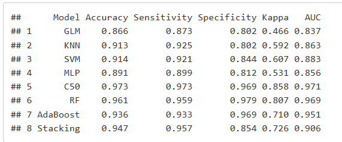

# 🧠 Portafolio Data & IA - GERSON CHANCAS EVANGELISTA

> Repositorio personal donde reúno proyectos de ciencia de datos e inteligencia artificial aplicados a problemas del mundo real.

---

## 🧭 Índice
1. [📂 Lista de Proyectos](#-lista-de-proyectos)
2. [🎯 Objetivos Profesionales](#-objetivos-profesionales)
3. [📫 Contacto](#-contacto)

---

## 📂 Lista de Proyectos

> 🚀 Cada proyecto representa el uso de datos para transformar decisiones en oportunidades.

### 📌 **2. DOG RECOGNITION – COMPUTER VISION (Bombom & Pulpo)**

- 🧾 **Descripción:**  
  Proyecto de visión por computadora desarrollado para identificar a mis perritos **Bombom** y **Pulpo** a partir de imágenes en tiempo real. Este proyecto tiene un profundo valor personal, nació como un pequeño proyecto para aplicar lo aprendido y que ahora lo tengo como **homenaje a Bombom**, quien falleció el **16/11/2025** debido a ehrlichia.  
  Más allá de lo emocional, el proyecto demuestra la aplicación práctica de técnicas de *Computer Vision* para diferenciar individuos mediante el uso de **SIFT** como extractor de características y modelos clásicos de *Machine Learning*.

- 🔧 **Tecnologías y herramientas:**
  - **Python**
  - **OpenCV** (procesamiento de imágenes, SIFT, webcam)
  - **Scikit-learn** (Random Forest, SVM, KNN, Decision Tree)
  - **NumPy / Matplotlib**
  - **Jupyter Notebook**

- 🛠️ **Métodos utilizados:**
  - **SIFT** como extractor de características
  - Vectorización mediante promedios de descriptores
  - Modelos supervisados (Random Forest, SVM, KNN, Decision Tree)
  - Clasificación en tiempo real con webcam

- 📊 **Resultados Clave:**
  - Dataset personal construido con **51 imágenes**:
    - 17 de Bombom  
    - 17 de Pulpo  
    - 17 de otros (Fondo negro)  
  - Extracción de vectores de características mediante SIFT para cada imagen
  - Entrenamiento de cuatro modelos: **KNN, SVM, Decision Tree y Random Forest**
  - **Random Forest** logró el mejor desempeño:
    - *Accuracy:* **100%** en el conjunto de evaluación  
    - *Precisión, Recall y F1-score:* perfectos por clase  
  *Nota:* Dado que se trata de un proyecto introductorio con un dataset pequeño, es esperable obtener métricas muy altas. Estas sirven únicamente con fines demostrativos y no representan un modelo listo para producción.
  - Implementación de un sistema en tiempo real que:
    - Detecta una región central en la webcam  
    - Extrae características SIFT  
    - Predice la clase del perro al instante

- 🔗 **Código:**  
  [ComputerVisionBombomPulpo](https://github.com/GersonEvangelista/ComputerVision_Bombom_Pulpo.git)

- 🖼️ **Preview:**
  [videoDemo](https://www.linkedin.com/posts/gersonchaev_computervision-machinelearning-sift-activity-7356158652677857281-g0oJ?utm_source=share&utm_medium=member_desktop&rcm=ACoAAEF4LxoBl7uEUeQnVZ7eWyM--kMamk_4raw)
  
  

### 📌 **1. BANK PERSONAL LOAN MODELLING**

- 🧾 **Descripción:** Proyecto centrado en un banco que busca identificar clientes con alta probabilidad de contratar préstamos personales. El objetivo es transformar clientes pasivos en activos mediante estrategias basadas en modelos predictivos.

- 🔧 **Tecnologías y herramientas:**
  - **R**: Exploración de datos, ingeniería de variables y modelado supervisado.

- 📊 **Resultados Clave:**
  - Métricas de evaluación: matriz de confusión, AUC, precisión, sensibilidad, especificidad y estadístico Kappa
  - Identificación de clientes propensos a adquirir préstamos personales para campañas dirigidas

- 🔗 **Demo Interactivo y Código:**  
  [Modelo de préstamo personal bancario](https://gersonevangelista.github.io/Bank_Personal_Loan_Modelling_GCE/Bank_Personal_Loan_Modelling.html)

- 🖼️ **Preview:**  
  

---

## 🎯 Objetivos Profesionales

✅ Aplicar ciencia de datos e IA para resolver problemas reales.  
✅ Comunicar hallazgos a través de visualizaciones claras y dashboards interactivos.  
✅ Integrar modelos predictivos en flujos de negocio y productos digitales.  
✅ Seguir perfeccionando habilidades en machine learning y deep learning.

---

## 📫 Contacto

¿Tienes una propuesta o deseas colaborar en proyectos de datos e inteligencia artificial?

- 💼 LinkedIn: [https://www.linkedin.com/in/gersonchaev](https://www.linkedin.com/in/gersonchaev)  
- 📧 Email: [chancasevangelistagerson@gmail.com](mailto:chancasevangelistagerson@gmail.com)  
- 💻 GitHub: [https://github.com/GersonEvangelista](https://github.com/GersonEvangelista)

---

## 📝 Licencia

Este repositorio está bajo la Licencia [BACHI](gce_chaev).
